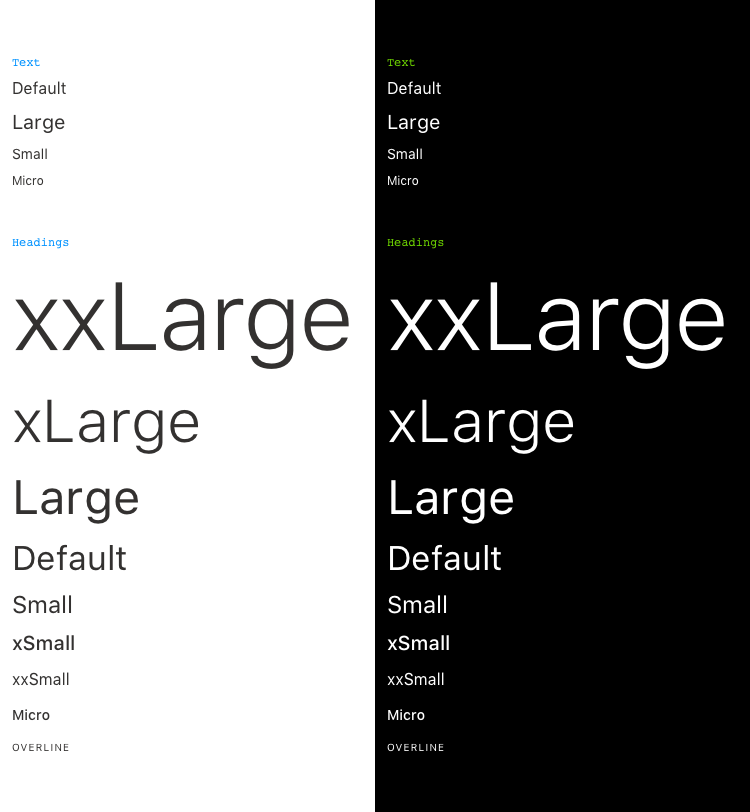

# 🖋 Click Typography

Typography can help create clear hierarchies, organize information, and guide users through a product or experience. Our default typefaces are designed for legibility and can adapt to a variety of visual palettes.

## Font size

**Use a comfortable reading size for body text.** For most text, including body copy, use at least an effective size of 16px (`fontSizeBase`). Smaller and larger text can be used sparingly for special purposes (like headings, captions, citations, footnotes, data tables, or specialized UI).

- Use font sizes between `Text Small` and `Text Large` for most running text.
- Sizes smaller than `Text Micro`, `Heading Micro` and `Heading Overline` should be used more sparingly — for shorter companion text or typographic 'eyebrows' such as captions, footnotes, photo credits, or specialized UI.

#### **Font size options:**

| Name               | Value |
| ------------------ | ----- |
| `Text Default`     | 16 pt |
| `Text Small`       | 14 pt |
| `Text Micro`       | 12 pt |
| `Text Large`       | 20 pt |
| `Heading xxLarge`  | 96 pt |
| `Heading xLarge`   | 60 pt |
| `Heading Large`    | 48 pt |
| `Heading Default`  | 34 pt |
| `Heading Small`    | 24 pt |
| `Heading xSmall`   | 24 pt |
| `Heading xxSmall`  | 16 pt |
| `Heading Micro`    | 14 pt |
| `Heading Overline` | 10 pt |

### Example

## Text alignment

While right-aligned, centered, and justified text have their place, most products benefit from a consistent use of left-aligned text. Justified text, common in print, does not yet display well enough in a responsive medium to be considered a best practice for long form text.

#### **Text alignment options:**

| Name           | Value   |
| -------------- | ------- |
| `Text Left`    | left    |
| `Text Right`   | right   |
| `Text Center`  | center  |
| `Text Justify` | justify |

## Line height

Line height controls the vertical rhythm and density of a block of text. It is written as a unit-less multiplier of the text’s font size — for instance, a line height of 1.5 on `Text Default` (16pt) text results in a line height of 24px.

**Longer texts require more line height.** Headings and other content elements no longer than a line or two can have a line height of 1 (`Line Height Heading`) and 1.2 (`Line Height Tight`) for intro and leads. Longer body and paragraph texts should have a line height of at least 1.5 (`Line Height Default`).

#### **Line height options:**

| Name                  | Value |
| --------------------- | ----- |
| `Line Height Default` | 1.5   |
| `Line Height Tight`   | 1.2   |
| `Line Height Heading` | 1     |

### Font style

The style of a font affects its readability. Generally, serif typefaces are more appropriate for long blocks of text and sans serif typefaces are more appropriate for user interfaces — but this is not a hard-and-fast rule. The digital conventions are more forgiving of longer, sans serifed texts and conversely serif UIs are not out of the question for experiences of a certain tone.

**Avoid long sections of italic or bold text.** Both italic and bold text can degrade readability. Both are best used for limited sections of contrast. Consider replacing long sections of bold or italic text with a callout box, a section header, or some other technique that avoids extended stretches of styled text.

**Avoid long sections of uppercase text.** Uppercase text has a serious negative effect on readability. Unless mandated by law, consider other type treatments for any uppercase text longer than just a few words.

#### **Font style options:**

| Name                  | Value     |
| --------------------- | --------- |
| `Font Weight Light`   | 300       |
| `Font Weight Regular` | 400       |
| `Font Weight Medium`  | 500       |
| `Font Weight Bold`    | 700       |
| `Text Transformation` | uppercase |
| `Text Decoration`     | underline |

## Letter-spacing

Letter-spacing is the spacing between individual letterforms in a block of text. Typically, this is defined by the type designer and shouldn’t be modified. However, certain specific situations can call for letter-spacing adjustments.

**Very small text can use looser letter-spacing.** At very small type sizes, extra letter-spacing helps improve readability.

**Very large text can use tighter letter-spacing.** Tighter letter-spacing can improve large headings.

**Text set in uppercase or small caps should use looser letter-spacing.** Uppercase text and small caps can appear too tight with normal letter-spacing and should use `Letter Spacing Loose` or `Letter Spacing Max`.

#### **Letter spacing options:**

| Name                   | Value |
| ---------------------- | ----- |
| `Letter Spacing Tight` | -1    |
| `Letter Spacing None`  | 0     |
| `Letter Spacing Loose` | 1     |
| `Letter Spacing Max`   | 1.5   |

## Font families

**iOS**

- San Francisco Pro

**Android**

- Roboto

**Web and Print**

- Aeonik
- Arial

#### **Font family options:**

| Name          | Value                                                                                                                                                   |
| ------------- | ------------------------------------------------------------------------------------------------------------------------------------------------------- |
| `Device Font` | 'System', -apple-system, BlinkMacSystemFont, 'Segoe UI', Roboto, Helvetica, Arial, sans-serif, 'Apple Color Emoji', 'Segoe UI Emoji', 'Segoe UI Symbol' |
| `Brand Font`  | Aeonik,'Helvetica'                                                                                                                                      |
